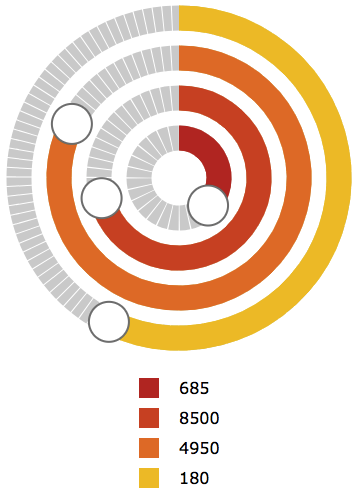

# Circular Slider
Circular Slider based on SVG. Implemented using native JavaScript. Tested in Google Chrome, Mozilla Firefox and Safari (web & mobile).

## Installation
To use the circular slider put ```<link rel="stylesheet" type="text/css" href="circular-slider.css" media="screen" />``` and ```<script src="circular-slider.js"></script>``` inside the ```<head>``` tag of your HTML file. The files are located in the ```dist``` directory.

### Demo
A demo of the functionality is included in the project. To view the demo run ```demo/demo.html```.

## Usage
You can use the circular slider by creating a CircularSlider. Every class instance needs to be provided with an SVG container object, which functions as a placeholder (with given width and height) for other SVG elements:
```html
<svg id="container" width="400" height="600"></svg>
```

Other required properties are ```color``` (circle bar color), ```min``` (minimum value), ```max``` (maximum value), ```step``` and ```radius``` (circle radius in px).

### Examples
- An example of a circular slider:

```javascript
const container = document.getElementById('container');

new CircularSlider({
    'container': container,
    'color': '#c0392b',
    'min': 500,
    'max': 1000,
    'step': 5,
    'radius': 40
});

new CircularSlider({
    'container': container,
    'color': '#d35400',
    'min': 5000,
    'max': 10000,
    'step': 100,
    'radius': 80
});

new CircularSlider({
    'container': container,
    'color': '#e67e22',
    'min': 100,
    'max': 6000,
    'step': 50,
    'radius': 120
});

new CircularSlider({
    'container': container,
    'color': '#f1c40f',
    'min': 0,
    'max': 360,
    'step': 36,
    'radius': 160
});
```


